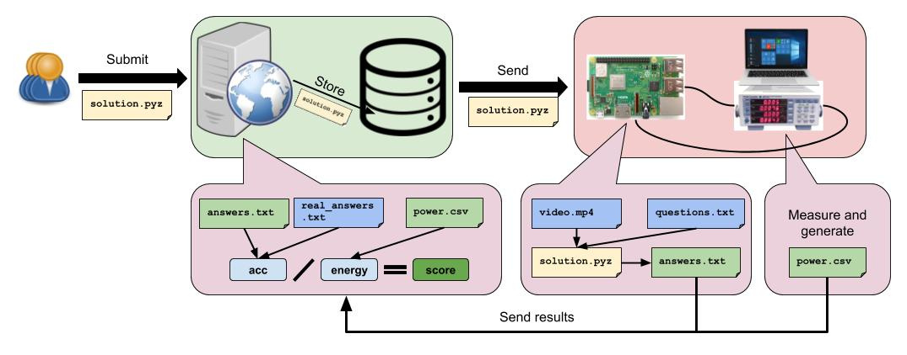

# LPCVC-Referee
The evaluation systems (referee) for the 2020 and 2021 Low Power Computer Vision Challenge.



## GitHub File Structure

```.
├─── bin 
│    └── test-solution 
│
├─── lpcvc 
│    ├─── LPCVC2020 
│    │    ├─── ld_calc.py 
│    │    ├─── lpcvc.py 
│    │    ├─── scoring.py 
│    │    └─── test_sub 
│    └─── LPCVC2021 
│         ├─── compare.py 
│         ├─── data_set.py 
│         ├─── read_solution.py 
│         └─── README.md 
├─── scripts 
│    ├─── install.sh 
│    └─── pi_firewall.sh 
├─── setup.py 
```
- bin includes scripts that come with package
- lpcvc includes Python Code
- setup.py installs package onto conda environment.
- scripts directory is to set up the server environment.

## Required Hardware and Software
 - Yokogawa WT310 Power Meter (discontinued, substitutable with the [WT310E](https://www.electro-meters.com/yokogawa/yokogawa-power-meters/wt300e/) model)
 - Linux Server
   - LPCVC Referee (this repo)
 - Windows Computer
   - [Yokogawa YKMUSB USB Driver](https://tmi.yokogawa.com/us/library/documents-downloads/software/usb-driver/)
   - [Microsoft Visual Studio](https://visualstudio.microsoft.com/downloads/)
   - [Python 3](https://www.python.org/downloads/windows/)
   - OpenSSH ([Windows 10](https://docs.microsoft.com/en-us/windows-server/administration/openssh/openssh_install_firstuse), [before Windows 10](https://github.com/PowerShell/openssh-portable/releases))
   - [HELPS WT310 Controlling Program](https://github.com/anivegesana/WT310)
 - Raspberry Pi (__Subject to Change for 2021__)
   - [Fedora 32 Minimal](https://fedoraproject.org/wiki/Architectures/ARM/Raspberry_Pi)

## System Setup (__Subject to Change for 2021__)

### Setting up the Yokogawa WT310 Power Meter
The power meter must be connected so that it can record the power consumption of the Pi.

### Setting up the Linux Server
Create a virtual environment for this repository and install the requirements from requirements.txt. Create a folder to store the submission files and update the `SUBMISSION_DIR` variable of the lpcvc.py file in this repository.
Create an SSH key for the Linux Server using the ssh-keygen utility.

### Setting up the Windows Computer
After installing Microsoft Visual Studio and Python 3, open the HELPS WT310 Controlling Program solution and build the solution. Update the locations of the Python binary and the Debug folder in the `METER_CMD` and `METER_CSV` variables of the lpcvc.py file in this repository.
Create another SSH key for the computer using the ssh-keygen.exe utility. Add the Linux Server key to the authorized_keys file in the user/.ssh folder using the ssh-add.exe utility.

### Setting up the Raspberry Pi
Run the following commands on the Raspberry Pi.
```bash
sudo dnf update
sudo dnf install git cmake ninja-build clang unzip distcc python3-virtualenv python3-devel python3-opencv python-pillow gstreamer1-plugins-base gstreamer1-plugins-good
sudo reboot
```
Create a virtual environment for the solutions with the `--site-packages` option. Create an empty folder for the testing of the submissions. Update the `PI_TEST_DIR` variable of the lpcvc.py file in this repository.
Create yet another SSH key for the Linux Server using the ssh-keygen utility. Add all three keys to the authorized_keys file in the ~/.ssh folder using the ssh-add utility.
__DO NOT__ add the Pi's key to the other two machines. Doing so is a security risk.

## Using the Referee (2021)

### Installing Program to Score Submission
You need to clone this repository, and then run the following command.
```bash
python3 setup.py install
```
This will make the script 'test-solution' available to you in any working directory. As a result, you can run the program from any directory without the need to pinpoint the location of the script.

```bash
test-solution [-t Threshold] [Submitted CSV file] [Correct CSV File]
```
Threshold: Integer that correspons to the number of frames away the submitted input answer can be from the correct input when tracking when a ball is caught. This is an optional argument, and the default is 10.
Submitted CSV File: Result CSV file from submission.
Correct CSV File: The Ground Truth CSV file.

The end goal is for the Submitted CSV File to closely relate to the Correct CSV File in order to detect the accuracy of your solution.  

#### [How The Score is Determined](lpcvc/LPCVC2021/README.md)

## Using the Referee (2020)

### Starting the Referee Queue
```bash
nohup python3 -u ./lpcvc.py r &
```
This command with dump the logs generated by the queue to the nohup.out file.

### Seeing the Logs in Real Time
```bash
tailf nohup.out
```

### Manually Enqueuing Submissions
```bash
touch queue/test.pyz
```

### Stopping the Referee Queue
```bash
ps ax | grep python3   # find the queue process in this list
kill 1000              # kill the task associated with the queue
```
`kill` may take some time because it will wrap up the current submission that is being tested. __DO NOT__ use `kill -9` or the power meter may go into an indeterminate state and require a manual reset. This is a very hard thing to do right now.


### GitHub Actions
The team uses GitHub Actions for automatic deployment to Graduate Students Computer.
This is done by creating a ssh channel through GitHub, which as a result, run a 
command on the computer to automatically install. The username, password, and port is 
encrypted, and no PR or Fork can trigger a run on the computer.

##### Setting up GitHub Action

This page is located under Settings, then Secrets.

You click on New repository secret, and enter the HOST (url to computer), username, password, and port (usually 22).

Keep in mind, that the repo have to be named 
```
~/referee
```
The name of directory must be named 'referee'.
After that, the setup is complete.
